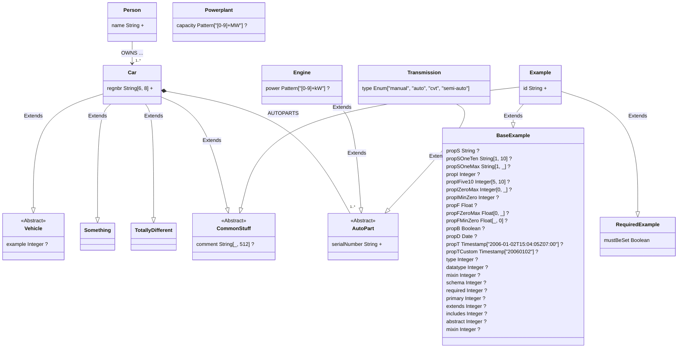

# Package example

## Types
### AutoPart
* Abstract: true

| property | type | kind | description |
| -------- | ---- | ---- | ----------- |
| serialNumber | String | primary | 

 |
### BaseExample
| property | type | kind | description |
| -------- | ---- | ---- | ----------- |
| propS | String |  | 

 |
| propSOneTen | String[1, 10] |  | 

 |
| propSOneMax | String[1, _] |  | 

 |
| propI | Integer |  | 

 |
| propIFive10 | Integer[5, 10] |  | 

 |
| propIZeroMax | Integer[0, _] |  | 

 |
| propIMinZero | Integer |  | 

 |
| propF | Float |  | 

 |
| propFZeroMax | Float[0, _] |  | 

 |
| propFMinZero | Float[_, 0] |  | 

 |
| propB | Boolean |  | 

 |
| propD | Date |  | 

 |
| propT | Timestamp["2006-01-02T15:04:05Z07:00"] |  | 

 |
| propTCustom | Timestamp["20060102"] |  | 

 |
| type | Integer |  | 

 |
| datatype | Integer |  | 

 |
| mixin | Integer |  | 

 |
| schema | Integer |  | 

 |
| required | Integer |  | 

 |
| primary | Integer |  | 

 |
| extends | Integer |  | 

 |
| includes | Integer |  | 

 |
| abstract | Integer |  | 

 |
| mixin | Integer |  | 

 |
### Car
* Extends: [Vehicle](#vehicle), [Something](#something), [TotallyDifferent](#totallydifferent), [CommonStuff](#commonstuff)

Car is a car...

| property | type | kind | description |
| -------- | ---- | ---- | ----------- |
| regnbr | String[6, 8] | primary | 
regNbr is the registration number of the car. It is a string between 6 and 8 characters long.
 |
#### Compositions
* **AUTOPARTS** &#9670;-> (one:many) [AutoPart](#autopart)
### CommonStuff
* Abstract: true

| property | type | kind | description |
| -------- | ---- | ---- | ----------- |
| comment | String[_, 512] |  | 

 |
### Engine
* Extends: [AutoPart](#autopart)

| property | type | kind | description |
| -------- | ---- | ---- | ----------- |
| power | Pattern["[0-9]+kW"] |  | 

 |
### Example
* Extends: [BaseExample](#baseexample), [RequiredExample](#requiredexample), [CommonStuff](#commonstuff)

| property | type | kind | description |
| -------- | ---- | ---- | ----------- |
| id | String | primary | 

 |
### Person
| property | type | kind | description |
| -------- | ---- | ---- | ----------- |
| name | String | primary | 
name is the name of a person. This is a very long lore ipsum text for the purpose of     seeing what the output of multiple lines of description will look like. Does blank lines     survive?      After blank line.     And the all lived happiley everafter.     THE END  
 |

#### Associations

* **OWNS** --> (one:many) [Car](#car) 
    | property | type | kind | description |
    | -------- | ---- | ---- | ----------- |
    | since | Date |  | 

 |
### Powerplant
| property | type | kind | description |
| -------- | ---- | ---- | ----------- |
| capacity | Pattern["[0-9]+MW"] |  | 

 |
### RequiredExample
| property | type | kind | description |
| -------- | ---- | ---- | ----------- |
| mustBeSet | Boolean | required | 

 |
### Something
### TotallyDifferent
### Transmission
* Extends: [AutoPart](#autopart)

| property | type | kind | description |
| -------- | ---- | ---- | ----------- |
| type | Enum["manual", "auto", "cvt", "semi-auto"] | required | 

 |
### Vehicle
* Abstract: true

| property | type | kind | description |
| -------- | ---- | ---- | ----------- |
| example | Integer |  | 

 |
