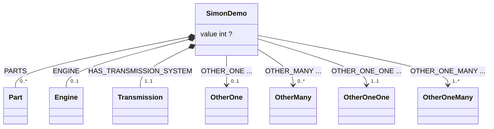

# Package test

## Types
### Engine
### OtherMany
### OtherOne
### OtherOneMany
### OtherOneOne
### Part
### SimonDemo
Docs for Simon Demo. Blah blah blah Lore ipsum blah.

| property | type | kind | description |
| -------- | ---- | ---- | ----------- |
| value | int |  | 

 |

#### Associations

* **OTHER_ONE** --> (one) [OtherOne](#otherone) 
If there is another one it is linked with this link (showing (one))
    | property | type | kind | description |
    | -------- | ---- | ---- | ----------- |
    | someProperty | int |  | 
Some documentation
 |

* **OTHER_MANY** --> (many) [OtherMany](#othermany) 
If there is another one it is linked with this link (showing (many))
    | property | type | kind | description |
    | -------- | ---- | ---- | ----------- |
    | name | string & strings.MinRunes(1) & strings.MaxRunes(80) |  | 
Some documentation
 |

* **OTHER_ONE_ONE** --> (one:one) [OtherOneOne](#otheroneone) 
If there is another one it is linked with this link (showing (one:one)
    | property | type | kind | description |
    | -------- | ---- | ---- | ----------- |
    | anInt | int |  | 
Some documentation
 |

* **OTHER_ONE_MANY** --> (one:many) [OtherOneMany](#otheronemany) 
If there is another one it is linked with this link (showing (one:many))
    | property | type | kind | description |
    | -------- | ---- | ---- | ----------- |
    | anInt | int |  | 
Some documentation
 |
#### Compositions
* **PARTS** &#9670;-> (many) [Part](#part)
* **ENGINE** &#9670;-> (one) [Engine](#engine)
* **HAS_TRANSMISSION_SYSTEM** &#9670;-> (one:one) [Transmission](#transmission)
### Transmission
