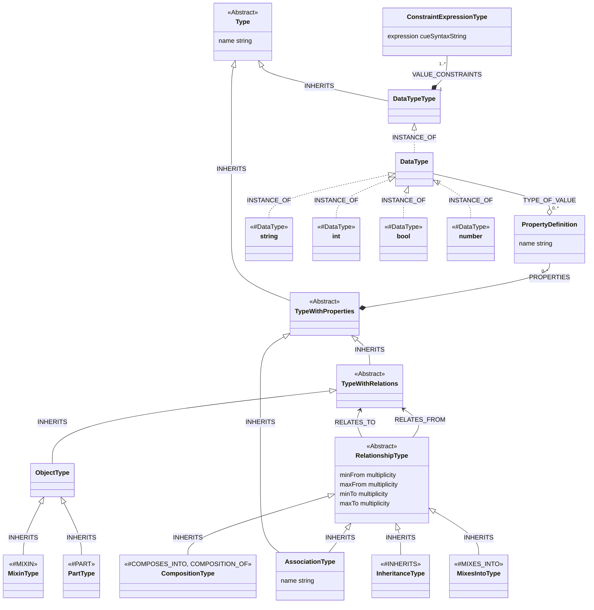
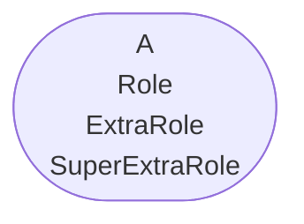

# Meta Model in Arrows

A meta model describes types having properties and their relations. A meta model is often referred to as a Schema.
We want authoring of meta modeling in our problem domain to be both convenient and understandable. Our modeling concepts should be in harmony with the technical platforms we may use for realizing such models.

Most technologies have their own terminology and there are subtle differences between them.

* *Instance* a representation of an individual real world "thing" or "conceptual thing". Instances have Type as a classifier "what they
  represent.
* *Type* the definition of what something is. It describes what the requirements are and what constraints must be satisifed 
  for an instances to have this type.
* *Struct* something having zero to many properties and a Name (a.k.a Object, Node).
* *Property* an attribute of a struct having a Name and a Data Type (a.k.a Attribute, Member).
* *Data Type* the subset of all types that can be used as property types (in most DB technologies this is a single value type).
* *Relationship* an association between structs, having a Name/Type, and Properties (a.k.a Edge, Link, Relation).
  Association, Composition, Agregation, and Inheritance are specializations of Relationship.
* *Composition* a relationship modeling that the parts of a composition are an integral part of a composition and do not have
  a life cycle of their own (created and deleted with the composition).
* *Aggregation* similar to Composition but where "parts" have individual life cycles.
* *Inheritence* a relationship where a subtype inherits the traits of a supertype. This is used to avoid repetition as a common trait 
  is only modeled once.
* *Mixin* an optional inheritence (~ role) - if a Person could optionally also be a MotorVehicleOwner, then that mixin's traits are inherited.
* *Abstract Type* there are never any instances having this type. Not to be consused with what is considered "abstract"
  in the real world (e.g. "the oil industry", "love" are real world abstract, but may be represented by something concrete.
* *Meta Model* a set of types (a.k.a schema, type model)
* *Instance Model* a set of instances compliant with a Meta Model (a.k.a data model - but this is highly ambigous since some refer to 
  the "meta model" as the "data model")
* *Primary Key* the unique identifier of an instance external to the technology used to store it. Can be a single property or multiple properties.

The modeling levels are

* Level 0 - The real world (physical, or conceptual). A Physical Car. The notion of the "Oil Industry".
* Level 1 - A description of the real world captured in a model `Car{ regNbr: ABC123 }`, expressed in a programming language (Java, Go, JSON, YAML, etc).
* Level 2 - A description of the abstractions at level 1. This is what we refer to as a meta model (or "schema"). "In our schema we have
  an abstraction named 'Car', it may have these properties...".
* Level 3 - A description of a meta-model (schema). This is what we refer to as a meta-meta model ("schema technology", which may
  or may not be expressed in terms of itself. "They way to express that there is such a thing named 'Car'".
* Level 4 - Best discussed after too many beers. ("The way to express that there are ways to express that there are things...").
  
Since some of these terms are highly ambiguous (depending on which technology one uses as reference) it is best to refer to
Level 0 as "real world" , the data about the world as just "data" or "information" (Level 1), and "schema" or "meta model" for (Level 2).
(Levels 1-3 are all described in a "model", be it graphical, tabular or textual form).

## Neo4j
In Neo4j Structs can be stored as Nodes, and relationships form Edges between nodes. Edges can also hold properties.
All nodes with a particular label form a set. Neo4j is "schema optional", having no constraints unless constraints are added.
Constraints are used to form a "schema" where nodes having a particular label must have required properties set, and a property (or property group) can be constrained to be unique (i.e. function as a "primary key"). The same applies to properties of relationships. Neo4j can however not constrain the endpoints of a relationship type - any type of relationship can be formed between any two nodes. (For example a relationship can be formed between two completely empty nodes without labels based on just their internal identity).

Neo4j does not have cascading deletes. Thus it is very easy to end up with garbage floating around. Cascading deletes are completely manual, but could be done via triggers (i.e. "automated").

(Note: The use of all but one type of constraints requires an Enterprice License.)

Additional constraints can be implemented as Triggers. The "neosemantics" package (free) for example can be added to Neo4j and it allows constraints to be described using SHACL. ShACL is defined by W3C and relates to RDF. In order for this to work a mapping between our model in Neo4j terms and RDF is required. Afaik it adds triggers that invoke neosemantics functions that performs the validation and aborts the transaction on validation errors.

Because of this,
we will constrain everything *before* importing data to a Neo4j db. We are then free to have the type of constraints
we care to implement (in custom validator or with some schema technology; jsonschema, openapi, cue, etc).

## Other graph DB based on RDF
To use a RDF store We naturally need to map to RDF and SHACL (and other conceptual models). Which we may want to do in any case to make use
of existing ontologies (using for example Neo4j and neosemantics to start with).
We should therefore allow for our meta meta model to describe the required data for such transformations.
# Our model
We define our own meta-meta model which we use to interpret meta models pertaining to our domains of interest.
We can express a meta-model using Arrows as a modeling tool. It was designed to model data at Level 1 so the fit isn't perfect,
but it is an easy (enough) to use tool for anyone. We impose a set of conventions how to express a meta-model in Arrows.

This document is all about our meta-meta model and how it is realized in Arrows (a Level 2 model) and in YAML (or JSON) files (a Level 1 model). This allows us to later also draw Arrows Level 1 models, or express them in other forms (tabular for example). It also means we are not tied to one DB technology or modeling technology (except our own - which we can bend to shape our needs).

We can use the following concepts in our modeling. I will examplify with Arrows (but since it is grahical in nature, I am showing
a textual representation in YAML), and for Level 1 data conforming to the schema I will show data in YAML form. There are diagrams
showing the meta-meta model (which when this README was written was only conceptual, but is now implemented in the Yammm package).


The Yammm (Yet Another Meta Meta Model) serves as the modelling hub. The schema in arrows is tranlated into a Yammm model (which can be saved and read back in the form of Json). A Yammm model can be transformed to other schema forms: jsonschema for backing editing and basic validation, cue for additional validation, go code to enable operating on instances of the model in Yaml or Json, and to Cypher code to initialize a Neo4j db.

At the instance level:

```mermaid
flowchart
   story(["story in yaml"])
   vsc(["vsc"])
   replaceId(["replaceId"])
   cypher(["cypher"])
   langServer(["Json Yaml language server"])
   jschema(["schema in jsonschema"])
   cueschema(["schema in cue"])
   cue(["cue"])
   neo4j(["Neo4j"])
   jschema -->|tied to stories in| langServer
   langServer -->|provides validation and code completion| vsc
   story -->|processed by| replaceId
   replaceId -->|creates global ids in| story
   story -->|converts to| cypher
   story-->|edited with| vsc
   story-->|validated with| cue
   cueschema-->|constraints to validate against| cue
   cypher-->|used to create/update| neo4j
   vsc-->|on save| replaceId
```

## Type and DataType
For a meta model in Arrows we take the Caption of a node to represent the Node's type. For example "Car". The properties of Car describes the set of properties an instance (Level 1) of Car must, and can have, and the constraints on the set of values that can be assigned to each property.

For example (expressed in Cue):
```
#Car: {
    regNbr: string
}
```
In Cue, since it does unification of types and values, it is possible to list the same property more then once, or write more complex expressions inline. These two examples are equivalent.

```
#Car: {
    regNbr: string
    regnbr: =~"[A-Z]{3}[0-9]{3}"
}
#Car: {
    regNbr: string & =~"[A-Z]{3}[0-9]{3}"
}
```
Many constraints imply the basic data type. A regular expression pattern implies `string` for example. So does an (so called) enum of literal value, for example `"A"|"B"|"C"` (is the string "A" or the string "B", etc). There are numerical expressions that implies `number`.

To model this with Arrows, we simply add the property to the "Car" node. The name of the property is entered, and instead of a
Level 1 value, we take the value to describe the data type/constraints of this property. Here I found it easiest to just use the Cue language directly (to not have to invent and implement the notion of data types and their constraints).

We sureley want to define our own data types beyond the basic string, number (int, float), bool when they are used in multiple places, or when they are too long/complex to express on a single line. To do this I rely on how our meta-meta model is expressed in Cue.

To model such a datatype with Arrows, we define a node with the Caption being the name of the data type. This node is given a label of `#DataType` and each additional label is a type constraint. In Arrows expressed (in Yaml):
```yaml
Node:
    caption: regNbr
    labels:
        - '#DataType'
        - string
        - =~"[A-Z]{3}[0-9]{3}"
```

It is illegal to define a `#DataType` with a caption that is the same as one of the basic data types (string, number, int, float, bool). To use the data type as the data type of a property it is given with a preceding hash mark. Here is `Car` rewritten to make use of the defined `regNbr` data type.

This "custom" data type can now be used in Cue like this.
```
#Car: {
    regNbr: #regNbr
}
```
It is allowed to combine this reference with additional constraints. For example, assuming there is also a pattern for `VanityRegNbr` this could be expressed as:
```
#Car: {
    regNbr: #regNbr|#vanityRegNbr
}
```

This means that the property "value" in a meta model in Arrows can be something like `string` or `#regNbr` (both are valid Cue and
the `#regNbr` exists as an effect of how we generate the Cue logic). Expressions like `#regNbr|#vanityRegNbr` (and many others) can therefore be directly expressed as the data type of a property.

## Inheritance
Inheritence is expressed by adding an `#INHERITS` relationship from the subtype to the supertype. A supertype of Car could for example be RegisteredMotorVehicle, or Vehicle. We can then express all common traits (properties and relationships) in a superclass and thus save a lot of work when authoring and modifying models, adding other types of Vehicles etc. Expressed in Cue this may look like this:
```
#Vehicle: {
    regNbr: #regNbr
}
#Car: {
    #Vehicle
}
```

We can make types Abstract; a data type for which there will never be any instances. I.e. we don't want to see any
"Vehicle" records (nodes) in our DB that are not also a concrete form of Vehicle (Car, Tractor,Bus, etc).

When we model this in Arrows we add the label `#Abstract` to such types.

All concrete (i.e. non abstract) types will be added to the schema for the top node of a YAML document such that it is possible to
express such instances. The type word is pluralized. In Cue this will look like this for the Car/Vehicle example:
```
#Vehicle: {
    regNbr: #regNbr
}
#Car: {
    #Vehicle
}
#Document: {
    Cars?: [...#Car]
    // No Vehicles?: since that type is marked #Abstract.
}
```
In an instance model the wrapping `Document` will be implied - so a corresponding snippet of knowledge compliant will this model expressed in Yaml would look like this:
```yaml
Cars:
    - regNbr: ABC123
    - regNbr: XYZ987
```

In the Cue model for the example the `Cars?:` means that the property is optional, and `[...#Car]` means a list/array of zero or more `#Car` compliant entries.

### Multiple Inheritance
Multiple inheritence is allowed, and so is having a chain of inherence. For example `A-[#INHERITS]->B-[#INHERITS]->C`. A node will inherit all traits for the transitive closure of its outgoing `#INHERITS` relationships.
All properties for the node, and all super types must unite (without conflict). 
For example a super type may constrain a property to a basic data type
while a subtype constrains it further. This is often expressed as in "type A narrows the property x inherited from B" (Note: in the fist implementation of arrows to Cue transformation properties have to be unique).

This means that when considering all instances in the set described by one type they will all be at least as constrained
as defined by that type, all subclasses have properties that are in subsets of the super type's corresponding set.
Vehicles could define regNbr as string, and Cars may narrow to 3 letters and 3 digits while some other subtype of Vehicle like Tractor may have 4 letters and must start with an A for Agricultural... 

With multiple inheritance it is possible to end up with the same type being a super type more than once. For example a `Mule` modeled as being a `Horse` and a `Donkey` and `Horse` and `Donkey` both inherits `Animal` and an animal has a property `p` then for a `Mule` the `x` property could be considered to exist several times for a `Mule` - one inherited from `Horse` and one from `Donkey`. In our model it is inherited once.

Circular inheritance is not allowed.

## Associations ("non special relationships")
Relationships in Neo4j are directional (although in Neo4j they can be navigated both ways without extra cost or specification). Semantics are implied, for example a relation `A-[LIKES]->B` may or may not be interpreted as bi-directional (B may HATE A for example). Other technologies may require that "reverse" relationships are added by name for navigation to be possible. In Dgraph for example, the `LIKES` would automatically exist (given that the schema says something is bidirectional) and be named `*LIKES`. Side Note: Association is the only type of relationship in Neo4j.

I skipped implementing support for other technologies atm. If needed we can add properties to relationships like `#bidir: bool` and `#reverseName` which for `LIKES` would be something like `LIKED_BY`. If I add that it would need some extra flag for Neo4j to be able to omit the reverse edge when it is not needed as a separate thing.

Relationships are not labeled in Neo4j - they have type, properties and to/from node references. It will be difficult to express inheritence among relationships and hence they will need to be modeled independently of each other. In practice probabably not a big deal since relationships typicaly do not have many properties if any at all.

When a document (Level 1 - describing instances) in Yaml, associations are formed by adding to the From node description.
The type of the association is by convention in upper case. We join that with the "to type" of the association to form
a property name - that is either a single reference or multiple references. A reference to another node's Primary Key(s) is
done with a `WHERE` property.

Also note that the data is declarative; references can can be both forwards and backwards in the document.

Here is an example where a Person type has two types of outgoing relations; `MOTHER` to `01` other `Person`, and
`SIBLINGS` to `0M` people. The relationships have properties. 

In Cue this is described like this:
```
#Person: {
    name+: string            // name is required
    MOTHER_Person:
        since: date
        WHERE: REF_TO_PERSON
    SIBLING_People: [...#EDGE_SIBLING_Person]
}
#MOTHER: {
   PERSON_WHERE: #REF_TO_PERSON
}
#PERSON_WHERE: {
    name: string
}
#EDGE_SIBLING_Person: {
    type: '"brother"|"sister"|"twin brother"|"twin sister"|"other"'
    WHERE: #REF_TO_PERSON
}
```

Here is what data in yaml (Level 1) looks like that is complicant with the above schema:
```yaml
People:
    -   name: 'June Doe'
    -   name: 'Jane Doe'
    -   name: 'John Doe'
        MOTHER_Person:
            since: '1959-03-08'
            WHERE:
                name: 'June Doe'
        SIBLING_People:
            -   type: 'sister'
                WHERE:
                    name: 'Jane Doe'
            -   type: 'brother'
                WHERE:
                    name: 'James Doe'
    -   name: 'James Doe
```
In yaml, the data above could be expressed using yaml compact form, where `{ }` is placed around structs, and `[ ]` around lists,
and indentation is then ignored. Instead of lines and indents, elements are separated with commans `,`.
The above can thus be written in a compact form like this (having the exact same meaning):

```yaml
People: [
    { name: 'June Doe' },
    { name: 'Jane Doe' },
    { name: 'John Doe', MOTHER_Person: { since: '1959-03-08', WHERE: { name: 'June Doe' }},
                        SIBLING_People: [ { type: 'sister', WHERE: { name: 'Jane Doe' }
                                          { type: 'brother', WHERE: {name: 'James Doe'} ] }
    { name: 'James Doe }
]
```
Which is 8 lines compared to 17. The compact form has the advantage that when using an editor that color codes and matches
braces and brackets it is really easy to match them up. It is harder to visually match up indents.
I prefer the compact for for repating short lists. The downside
is that it is more difficult to break out and copy/paste entire sections and reformat to suit a different location.
In the indented format it is very easy to add/remove indents and there is really no other formatting required from the author, whereas the compact format requires manually laying out elements for good readability.

### Note about primary keys
Note: in order to form relationships between instances, the target (to) node must have a unique (primary) key enabling it to be referenced.
While the store may have internal id values for every record/node, those are not stable over time and should only be used
inside queries where such id values are also retreived from the data store.

We could have "local" identifiers, values the author assign to allow referencing a node (this is what Arrows does). Since those
(by design) are not unique across documents they are not stored in the db (rather the instances will get new unique id values
in the context of the store where the instances (nodes) are added).

The best is to define primary keys for all types to which
relationships are formed. In RDF this is imperative - it won't work without it since everything is done via relationships.
W.I.P/under discussion and I have some design ideas to explore.

### Cardinality / Multiplicity

Associations (and Compositions) have cardinality - a relation drawn in a schema (Level 1) describes that relationship
may or must be formed for data to be valid. This is done by defining the multiplicity of the two ends of a relation.
The possible combinations are "01" (min 0, max 1), "11" (min 1, max 1), "0M" (min , max unlimited), and "1M" (min 1, max unlimited).
The default is "01" (at both ends).

In practical terms - having:
* a min of 1 means that the relation is required for instances to be allowed to be stored.
* a min of 0 means that the relation is optional.
* a max of 1 means that max one instance is to be expected as the result of following the relationshp - in an API
  this makes a big difference since that single value is typically represented as a single value as opposed to a list with
  one item.
* a max of many means that a list of instances is to be expected when following the relationship, the list may be empty if
  the relationsip is optional (min 0)

Here are some practical modeling tips:
* If both ends are "01" it means that instances of the two sides can freely and independently exist
* If one end is "11" the instance at that end must exist for the instance at the other end to exist - when ending up with
  a "11" in a model, it should probably be a Composition, so use that instead.
* It is easy to be confused between Level 1 and Level 2 here - remember that the level 2 meta model describes how instances are
  constrained. If there is a `(0M) Person --[MOTHER]-> (01) Person` relationship this means that you may find many instances of Person that
  have a MOTER relationship to another Person, and for any given Person there may be at most one mother.
* When using a graph store there are no issues in having many-to-many relationships, something that is more difficult and
  performance demanding with relational stores (where an extra table is required to store this).
* If you think you need to model "a specific number" rather than just, 0, 1, or many - like "a book has two covers",
  then that would not work so well in practice since it would not be possible to tell which cover is which. In these situations
  model it as two separate relations "FRONT_COVER" and "BACK_COVER". The only time it makes sense is when there is a higher number
  actual limit like "there are 100 radio station user defined presets", you would not want to have 100 different relationship for this, instead it comes up to applications to enforce this limit. The wyrth model only supports 0, 1, many (at least for now).

## Mixin

This is a variation of the inheritance described earlier. With inheritence all properties from all transitive super types are taken as if they were defined for the subtype. Thus if a super type requires a property to have a property set then all subtypes must have this set.
A Mixin can be seen as an optional set of properties and relationships - if a mixed in type is present instances of the type where it is miced in must comply with all constraints for the mixed in type. A mixin may not define the same properties as those of the type it is mixed into - or in other words - they do not unite.

In Arrows we model this by giving the Mixin type the label `#Mixin`. For a type we add the Caption of the Mixin as a Label to denote that data *may* have this Mixin. For example, for a Car we may have a SafetyTested Mixin with properties `"passed: bool, date: #date"` (both properties required if a Car is marked to be SafetyTested. The SafetyTested may have a relation to SAFETY_TEST_PROTOCOL and we don't want this relation to be formed unless the two required properties have values.

The schema in Cue:
```
#SafetyTested: {
    passed: bool
    date: "#date"
}
#Car: {
    regNbr: "#regNbr"
    SafetyTested?: "#SafetyTested"
}
```
And in Arrows (expressed in YAML):
```yaml
nodes:
    -   caption: SafetyTested
        labels:
            - '#Mixin'
        properties:
            -   name: passed
                value: bool
            -   name: date
                value: '#date'
    -   caption: Car
        labels:
            - SafetyTested  # this is what makes it allowed to mix this in
        properties:
            -   name: regNbr
                value: '#regNbr'
```
And in YAML here are two cars, one that passed a safety test:
```yaml
Cars:
    - regNbr: ABC123
      SafetyTest:
          passed: true
          date: '2022-10-24'
    - regNbr: XYZ987
```
When storing this in Neo4j, all properties are flattened. Thus, the Mixin serves the purpose of being a named group of properties and relations. For a node stored in Neo4j, there will be one label set per used mixin (plus naturally the properties). The example above
would result in the following Arrows data (in yaml):

```yaml
nodes:
    -   id: n0
        labels:
            - Car
            - SafetyTest
        properties:
            -   name: regNbr
                value: ABC123
            -   name: passed
                value: true
    -   id: n1
        labels:
            -   Car
        properties:
            -   name: regNbr
                valeue: XYZ987
```

**Usage**: Use a Mixin to define an optional group of properties for a type where the properties in the group (i.e. in the mixin) are
required. For example if a type can optionally have a Color, and Color is defined as having red, blue and green values. It cannot be
a data type (unless we come up with a single value representation), and it seems overkill to have a relationship to another type,
and if it was modeled as three direct optional properties then there is nothing enforcing that there are values for all. A mixin is also
useful as modeling a kind of role that the main type plays but that isn't complex enough to merit a type that leads to a separate database node/record. Or use mixins as a tagging mechanism - "something of this type can be tagged with ..." and then let the mixin have no properties.
The mixin in turn can mixin other such tags, for example for further detailing. If any of the constraints on mixins does not fit the use
case, consider using a Composition, or an Association relationship instead of Mixin.

## Composition
A Composition is a type of relationship describing a Composition with Parts where the parts are an integral part of the
composition and where they do not have individual lifecycles; they are create at the same time as the composition
(or possibly added to it later assuming the composition still exists), and they are removed from the db when the
composition itself is removed.

A Composition in YAML looks like a Mixin, but instead of having properties referencing another node, it will
specify all of the properties.

Here is the result of having modeled that a `Facade` is one type of part that a `Building` is composed of:

In Cue this is described like this:
```
#Building: {
    name: string
    Facade: #Facade
}
#Facade: {
   material: string
}
```
When a document (describing instances) in Yaml, relationships are formed to parts by adding to the From node description.
Here is an example:

```yaml
Building:
    -   name: 'The Gherkin, London'
        Facade:
            material: glass
```

We model a composition in Arrows (level 2) by having a relation from the Composition to a Part of type `#COMPOSED_OF`.
It is also allowed to form a composition with `#COMPOSES_INTO` with the direction of the relation being from Part to Coposition.
They both have the same result. Note: the `#COMPOSED_OF` is the preferred.


TODO: It is very useful to be able to model that there could be many instances of the part. It is also useful to have optional
parts. We could describe this with #*COMPOSES_INTO and #COMPOSES_INTO?. using #*COMPOSES_INTO? would mean that the composition would
have 0 to many of the part, and #*COMPOSES_INTO means 1 to many. To support this in cue, the construct will be similar to that
of the Document. The type is plualized and each part is in a list.

Here is a YAML example of a student with classes on different days.
```
Student:
   name: "Henrik"
   Classes:
        -  subject: English
           day: Monday
        -  subject: Computer Science
           day: Tuesday
```

## Property traits

A primary key is indicated with a `+` flag after the property name. For example `name+` means that this is unique (which implies an index is created). A `?` flag after a property name indicates it is optional. By definition it cannot be both optional and be a primary key since this would mean that there could only be one instance without this property.

The primary keys of a type are found in the corresponding REF_TO_... cue type definition.

## Multiple values in one property

Being able to model that a property is multivalued (a list or dictionary/map) would be powerful, but Neo4j does not support this.
Thus, all multivalued properties must instead be modeled as relations to details. While some technologies may support this, they can all handle the more general model where hat data is broken out into separate
nodes or table-rows.

Inherited property traits unite. 

## Singletons and instances
Sometimes it is useful to model certain important instance. A meta schema contains information about the types, but what if we want to specifically have nodes for well known entities like `IRS` and `BMV` so that relations can be formed to them directly in the meta model.

The default for nodes is that they describe a type. So for instances we draw a relationship `#INSTANCE_OF`from the instance node to the type node. The Caption wlll be used set as a neo4j label on the node representing DMV, (e.g. "DMV"), properties must be given values as required by the type e.g. `GovernmentalAgency`. Relatinoships drawn to the instance node means they can only be formed with instances of the type of node at the other end. If both ends are insances, then this relationship is unique to those two instances.

We may want to make it optional to restrict the types of relationship endpoints. (As opposed to letting everything inherit from something abstract like Object and define alls such "free for all" relationships.)

## Arrows meta model - additional details

The meta model is normalized as follows:

* If the node does not represent a DataType:
  * If Caption is missing, the first Label will be used as the Caption (and thus the type name)
  * If Caption is also in labels it will be dropped from label
  * The above two rules compares values ignoring case
  * The resulting Caption and set of labels are made to have initial caps
  * Any spaces in Caption or Labels are replaced by empty space. /"This Example" becomes "ThisExample")
* If the node represents a DataType:
  * labels are constraints in cue and are left as is
  * Caption is the name of the datatype and it must be unique. (CHECK: is it enforced to have initial lower key? and spaces removed?
* Relationship types are made into upper case, and spaces are replaced with `_`.

# TODO

* #Concept - idea being that there is an empty node with the label, thus forming a singleton instance acting as a marker.
* #Singleton - as described above - this is similar to Concept but an INSTANCE_OF relation is needed to type.
* Unique or Merge - in instance diagram, and in YAML
* Output comment with date/time, filename of original, version of converter
* Refactor code 
  * ~~now arrows specific data and CueMarshal data are mixed, they may not be the same and normalization, validation etc. are probably different. It is probably best to have completey separate models - Arrows is simply the arrows as is. It gets translated to our type model.~~
  * A Wyrth type model is needed as we don't want to parse the arrows to load that type model. While we can load the generated
    model in cue, that is possibly lossy depending on if the cue model can be reflected. For example, it is not enough to know
    the constraints of X, but also to know that X inherited Y and Z as we want an instance of X to be labeled with Y and Z in
    Neo4j. Implementing this model should be esier now that the refactoring above has been done.
* Allow `#MIXES_INTO` relationship pointing from Mixin to type mixing it in as an alternative to having a label. Warn if specified
  both ways.
* Make `string` the default property type
* Imports !!
* Human assigned IDs, and local IDs
 
# ISSUES
## How to store empty mixin
If a mixin has no properties, how is it represented in the node it is being mixed into?
If it has properties those are flattened and must be unique among the properties where it is mixed in.
In once sense it is ok if it is just labeled with the mixin name, that signals that it is known to have that "role"
The label is just as expressive as a boolean property - an neither of them allows an unknown state as opposed to knowing that they don't have that role. This distinction probably does not matter - if it does it has to be modelled differently.

For now, will just set the label. And in an instance simply do:
```
   Entity:
      name: "Exxon Inc"
      PowerProducer: {}  // sets the label, has no properties
```

## Relationships to a mixin
The current idea for mixins allows  relationships and they require knowing the primary key of the target node.
The alternative is to expose the ID of every element and form the relationships this way. The fromNode is never a problem since all
relationships are added to a particular node, but the toNode must be something defined with a primary key.
Thus a relationship to a mixin is always problematic since the primary key will be different depending on where the "to" mixin is mixed in!

Problem is similar if there are nodes (for example concepts) that have no properties, only a label and caption
Possile Solutions:
* scrap the mixin idea.
* allow mixin to only have outgoing edges to non mixins.

## Create Unique or Merge
How to define merge behavior in instance graph. Could have labels, where presence of #Merge label indicates that it should be merged. (Alternatively use #CREATE_UNIQUE and have merge behavior as default).

# Primary key, inheritence and Relations
What if a relationship is to a supertype and a subtype adds more primary keys? What does this mean?
Is there a difference if there are non abstract supertypes?

# Data type
* error if caption is not initial lower case
* cannot have same name as built in data type
* consider making timeStamp a built in string data type (not sure if json/yaml has actual dates
* Can data types inherit another data type (proably yes). They do not have mixins (can not be declared by definition).
  This is not an issue actually, since they can just state #type as a label.

# Documentation & Comments
It is very usefl to be able to model documentation such that it becomes available when authoring an instance model.
It becomes klunky to do this in Arrows since all possible elements properties/captions/labels are shown in the diagram
and they would completey overflow the boundaries of property/label-lists. It could be done with separate nodes containing properties that are long strings, and then user hides them. They can however not contain new line characters which makes
them kind of useless for documentation purposes.

A complimentary document could be written in markdown that links to the data types. When modelling documentation
would be written separately and the whit tool could link them together.

Cue does not have any "description" properties unfortunately, but we could perhaps generate a convention, and
possibly post process the openAPI schema generated by cue to inject documentation.

I did an experiment with `mermaid` (see at the bottom). Which is quite ok for making illustrations in a document.
## Experiment:
We can add a property as a description - for example `regnbr` has a description `#regnbr`. To describe the type itself
we use a property `#<typename>` for example `#Vehicle`. The description should just be a oneliner and Arrows seems to handle that ok. (Not yet implemented).

# Modeling
This section is a more formal description of the Wyrth's meta-meta model.

Note: I modeled "allowed mixins" as (UML) operations on a class since the list of mixins should be kept separate from the list of properties and there was nothing else that worked with mermaid UML lile class diagrams. (Just ignore the parentheses after the mixin name in this
illustration).



## Type
`Type` is an abstract super class defining that all types have a name. There are two sub classes `DataTypeType` (the type of data types),
and `TypeWithProperties`.

## DataTypeType & DataType
`DataTypeType` is the type of data types. 

The meta meta schema shows that an instance of `DataType` has the type `DataTypeType`. The diagram also shows the four built in
types `string`, `int`, `number` and `bool`. (They do have the corresponding `VALUE_CONSTRAINTS` - i.e. the cue type constraints "string", "int", "number", "bool", but this is not shown in the diagram to not make it too busy).

In a meta model (in arrows) a named data type is defined by labeling a node with `#DataType` and 
specifying the name of the data type as the node's `Caption`. The value constraints are entered as labels
on the node. The labels (except obviously the `#DataType` label) are expressed in the Cue Language. The labels will be joined together with `&`
(and) to form a complete cue expression. To express "or" semantics this must be expressed in one label (or as the type in a property) and be surrounded with parentheses if it is to be composed with "and" constraints since `a & b | c | d & e` means `(a&b) | c | (d&e)` due to operator precedence.

When defining a property for a `TypeWithProperties` in an arrows meta diagram, the data type part is a cue constraint expression (see below)
and it can use any cue expression including referencing a named definition. In most cases the value type will be one of the built in types. Most commonly it will be `string`, which is also the default if left blank. Here are some examples:

* `regNbr : =~"[A-Z]{3}[0-9]{3}"` - is a string (implied) that much match the regular expression
* `regNbr :` - is a `string` (default)
* `regNbr : string` - is a string
* `regNbr : #regNbr` - is a `#regNbr`, a `#DataType` defined elsewhere in the model
* `birthDate : #date | #timeStamp` - example of "or", a simple date or a date+time (both defined in the model).
  
### Value Constraints 
Value constraints are any cue expression. For example:
* `"A"|"B"|"C"` - only string (implied) values being "A" or "B" or "C".
* `>=1 & <100` - only number (implied) values greater than 0 and less than 100
* `=~[A-Z]{3}[0-9]{3}` - only string values (implied) matching the regular expression
* `#x` - constrained to the definition of the data type named `x` (i.e. the name of a `#DataType`)

### Built in data types
These data types are bult in:

*  null
*  string
*  number
*  int
*  float
*  bool
*  struct
*  list
*  bytes
*  uint
*  uint8
*  int8
*  uint16
*  int16
*  rune
*  uint32
*  int32
*  uint64
*  int64
*  int128
*  uint128
*  positive
*  byte
*  word

It is illegal to introduce a new data type with the same name as the built in.

## TypeWithProperties
`TypeWithProperties`, as the name implies, is for a type that is not a single value, and instead defines named properties where the value
is constrained by a `DataType`. There are two subtypes `TypeWithRelations` and `AssociationType` (a kind of relationship).

## TypwWithRelations
`TypeWithRelations` inherits from `TypeWithProperties` and adds the ability for a type to be an endpoint in a `RelationshipType`.
Basically this is now the same as `Object` and they may be squashed into just `Object`.

## ObjectType
`ObjectType` inherits from `TypeWithRelations` and there are two specialized subtypes `MixinType` and `PartType`. An instance of an `Object` (i.e. not a specialization) will have a node/record in a data store and has an independent lifecycle.

## Mixin
`Mixin` is a specialization of `ObjectType`. It can be a `RELATES_FROM` endpoint of a `MIXES_INTO` relationship or (referenced via
a label in an `ObjectType` (or its specializations). A `Mixin` is always embedded in what it mixes into and does not have an independent lifecycle.

All allowed mixins to a type must:
* Be unique within this set. For example a mixin cannot both be direct and inherited/nested within that mixin.
* All properties of all mixins must be unique within the allowed mixins and the type's properties since the final result is flattened.

The set of allowed mixins for an instance consists of:

* mixins directly specified for the type using labels
* for any super or mixin type being included, their inherited and nested mixins (transitively)


Here, the type `A` can mixin `Role`, and nested in `Role` mixin `ExtraRole`, and `SuperExtraRole`. When creating an instance
of `A` and specifying all possible mixins it would look like this:
```yaml
A:  aValue: "a value"
    Role: {
      bValue: "b value"
      ExtraRole: {
        cValue: "c value"
        dValue: "d value"
      }
      SuperExtraRole: {
        eValue: "e value"
      }
    }
```

A Neo4J Representation of the above would be like this:

Which depics a node with a label per mixin (flattened). Properties are not shown.

## PartType
`PartType` is a specialization of `ObjectType`. It can be a `RELATES_FROM` endpoint of a `COMPOSES_INTO/COMPOSED_OF` relationship.
A `PartType` is composed into something that controls the life cycle of the part (they are created and deleted together).
In contrast to a mixin, a part has its own storage (node/record).

* A `PartType` must be unique among all the parts that compose into a composition.
* The properties of a `Part` type does not have to be unique within all possible parts of a composition and the composition itself since
  a part has its own storage.
* A `PartType` cannot be in more than one composition since composition implies "parts have the same life cycle as the composition".

Usage: Use a composition when a mixin is to restrictive in terms of property names or where it is desired to acheive simple
nesting of the part inside the composition instance as opposed to having to have a separate entry for the "part" with an association
(normal) relationship containing a reference to that separate entry.

TODO: Examples like for Mixin.

## RelationshipType
Abstract super type, describes `RELATES_FROM`, and `RELATES_TO`. Specializations are done in arrows with the special
"relationship types" (Neo4j term) `#INHERITS`, `#MIXES_INTO`, and `#COMPOSES_INTO/#COMPOSITION_OF`. 

Relationship types have the four properties `minFrom`, `maxFrom`, `minTo` and `maxTo`. The min properties can be set to an integer 0 or 1,
and the max property to integer 1 or -1 for "many".

In an arrows diagram this is modeled by using the two properties `#from` and `#to`. The value is one of the strings:

* "11", min 1, max 1.
* "01" min 0, max 1. This is also the default
* "0M" or "M", for min 0, and unlimited many.
* "1M", for min 1 and unlimited many.

The properties start with `#` as these properties are at the meta-level; instances of the relationship type do not have
these properties.

Multiplicity has certain constraints depending on subtype of relationship.
## CompositionType
This is a specialization of `RelationshipType` type that describes a composition. It constrains the `RELATES_FROM` to be a
`PartType` if the relationship is `#COMPOSES_INTO` and `RELATES_TO` to e a `PartType` if the relationship is the (normal)
`#COMPOSED_OF` type of relationship

In Arrows this is modeled with a relationship having the relationship type set to "#COMPOSES_INTO"

In a `#COMPOSITION_OF` all multiplicities are allowed at the Part end. The "from" end is always "11" (since "a part cannot exist without
its composition). (The reverse holds for a `#COMPOSES_INTO`).
## InheritanceType
This is a specialization of `RelationshipType` type that describes inheritance. The `RELATES_FROM` is the subtype inheriting the traits (properties, relationships, composition, mixins) defined in the `RELATES_TO` supertype.

In arrows this is modeled with a relationship having the relationship type set to `#INHERITS`.

Multiplicity is ignored in an `#INHERITANCE` type of relationship. The subtype always has a supertype (per definition).
A "super type" may exist without having any sub types - it is then "just a type" (thus, if that type is abstract, it is (at least for the moment) quite useless, but it may be extended (given subclasses) later).

## MixesIntoType
This is a specialization of `RelationshipType` that describes a "mixes into". It constrains the `RELATES_FROM` to be a
`MixinType`.

In Arrows this is modeled with a relationship having the relationship type set to `#MIXES_INTO`, or by specifying it as
a label for the target type where it will be allowed to be mixed in.
