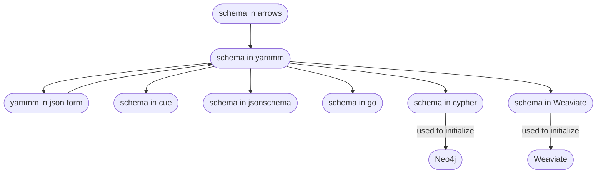

# YAMMM - Yet another Meta Meta Model

The YAMM package (Yet Another Meta Meta Model) is used to describe a meta-model (schema) and to generate corresponding
JsonSchema, Cuelang constraints, Cypher code, Weaviate and Go code. 


A Yammm model can be constructed by:
* Using the concrete Yammm DSL (recommended).
* Converting a schema following Yammm conventions for meta modeling in an Neo4J Arrows model.
* Describing it in Json.
* Writing Go code against the Yammm API.

The Yammm model can then be transformed to other forms for various purposes:
* The schema in *cue* can be used to validate data.
* The schema in *jsonschema* can be used to validate data interactively in VSC via the use of a json/yaml language server,
  which also provides code completion.
* The schema in cypher is a series of Neo4J statements to create indexes and constraints in a Neo4J DB.
* The schema in *go* can be used to operate on data using an API either concretely using the generated code directly, or abstractly via
  Yammm model based reflection.
* The schema can be used to validate instances of the model in JSON, YAML or Go.

# Usage
## Command-line Usage
Conversions are available via the command line tool `whit`. Conversions from an arrows model to Yammm :
```
whit arrows convert --format=yammm -o schema_in_yammm.json schema_in_arrows.json
```
Which would produce the yammm model in the file `schema_in_yammm.json` from the downloaded arrows file `schema_in_arrows.json`.

Conversions from an Yammm model to for example jsonschema:
```
whit yammm convert --format=jsonschema -o schema_in_jsonschema.json schema_in_yammm.json
```
To see the options run the commands with the `--help` flag. For example:
```
whit arrows convert --help
whit yammm convert --help
```

Conversion from the yammm DSL to yammm in json form is done with:
```
whit yammm parse  --out myschema.json myschema.yammm
```

The easiest to use is the Yammm DSL.

## API Usage

The central API is found in `yammm.Context`. It can load a serialized Yammm model in JSON format from disk or one can be constructed
using the context's API (which can then be operated on, and/or saved to disk).

An accompanying API `yammm.Meta` provides reflection when working with data instantiated as go structs.

The easiest way to create a model and a context is by using the Yammm DSL. The API allows parsing a string or a file. Here is an example of defining the schema in a string, parsing it into a context that has been validated.
It further shows how to present any errors in the given schema.
```
	source := `schema "example"
	/* Lore ipsum */
	type Car { regNbr String }`
	ctx, ic := parser.ParseString(t.Name(), source)
	if ic.HasErrors() || ic.HasFatal() {
		_ = validation.NewColorPresentor().Present(ic, validation.Info, os.Stderr)
		os.Exit(1)
	}
```
This is the recommended way of defining a schema. Further examples in this README will show how to do this
using literals in Go.
### Imports and Creating a Context
```
import "github.com/wyrth-io/whit/internal/yammm"

ctx := yammm.NewContext()
```

Validation and generation of output will require two additional packages:
```
import (
    "github.com/wyrth-io/whit/internal/pio"
    "github.com/wyrth-io/whit/internal/validation"
)
```
These (and other) imports are not shown in subsequent examples.

### Definition, Validation and Completion

When a context is created it is empty. After that, it can be given a model to operate on. This can be a model unmarshaled from disk, an empty model (a name is required), or a model already defined with types etc. After that more types and relations can be added to the model.

Here is an example of programatically creating a model from a literal model in go:
```go
	ctx := yammm.NewContext()
	err := ctx.SetMainModel(&yammm.Model{
		Name: "myfirstmodel",
		Types: []*yammm.Type{
			{Name: "Person", PluralName: "People",
				Properties: []yammm.Property{
					{Name: "name", Type: "string"},
				}},
		},
	})
	tt.CheckNotError(err)
	ic := validation.NewIssueCollector()
	ok := ctx.Complete(ic)
```

Here is an example reading the model from a `reader` (reading a marshaled yammm model):
```go
	ctx := yammm.NewContext()
	reader := strings.NewReader("...json string...")
	err := ctx.SetModelFromJSON(reader)
	ic := validation.NewIssueCollector()
	ok := ctx.Complete(ic)
```

Modification can be done before calling `Complete`. Here a `Person` type without properties is added to the model. This example
starts with an empty model, but it could have been loaded from Json and already have definitions.
```go
 	ctx := yammm.NewContext()
	model := yammm.Model{Name: "testmodel"}
	err := ctx.SetMainModel(&model)
	err = ctx.AddType("Person", []yammm.Property{})
```
See the `yammm.Context` interface for the available methods to add different kinds of types.

A complete model in JSON can look like this:
```json
{
	"name": "example",
	"types": [
		{
			"name": "Student",
			"plural_name": "Students",
			"inherits": [
				"Person"
			]
		},
		{
			"name": "Person",
			"plural_name": "People",
			"properties": [
				{
					"name": "name",
					"type": "string",
					"primary": true
				}
			],
			"mixins": [
				"Location"
			],
			"compositions": [
				{
					"to": "Head",
					"optional": true,
					"many": false
				},
				{
					"to": "Limb",
					"optional": true,
					"many": true
				}
			],
			"associations": [
				{
					"to": "Person",
					"optional": true,
					"many": false,
					"name": "MOTHER"
				},
				{
					"to": "Person",
					"optional": true,
					"many": true,
					"name": "SIBLINGS",
					"properties": [
						{
							"name": "since",
							"type": "string"
						}
					]
				}
			]
		},
		{
			"name": "Head",
			"plural_name": "Heads",
			"properties": [
				{
					"name": "hasHair",
					"type": "bool"
				},
				{
					"name": "id",
					"type": "string",
					"primary": true
				}
			],
			"is_part": true
		},
		{
			"name": "Limb",
			"plural_name": "Limbs",
			"properties": [
				{
					"name": "type",
					"type": "string"
				},
				{
					"name": "id",
					"type": "string",
					"primary": true
				}
			],
			"is_part": true
		},
		{
			"name": "Location",
			"plural_name": "Locations",
			"properties": [
				{
					"name": "long",
					"type": "string"
				},
				{
					"name": "lat",
					"type": "string"
				}
			],
			"is_mixin": true
		}
	],
	"data_types": [
		{
			"name": "date",
			"type": "string \u0026 time.Format(time.RFC3339Date)"
		}
	]
}
```
Once modifications of the model are finished the model must be _completed_. This is done with a call to `Complete`. This step validates the correctness of the defined model, performs cross referencing and sets up the internal state of the context such
that it is possible to make use of the model. Once the context/model is completed it is not possible to make further changes.

If errors were found during completion the result of trying further operations on the model are undefined.

```go
ic := validation.NewIssueCollector()
if !ctx.Complete(ic) {
    // Errors were found and recorded in the issue collector.
    // The collector may also contain warnings.
}
```

To present collected issues:
```go
	// Create a ColorPresentor and present all issues at Info level and below (i.e. info, warning, error, fatal)
	p := validation.NewColorPresentor()
	_ = p.Present(collector, validation.Info, os.Stdout)
```

It is also possible to use a terminating issues collector that will panic as soon as a `validation.Fatal` level issue is reported.
```go
ic := NewTerminatingIssueCollector()
```

It is also possible to limit the number of reported issues such that it will panic if this value is exceeded.
When the limit is reached it will add a final message stating that there were too many reported issues.
```go
    ic := NewIssueCollector(100)
```

For other methods see the `validation` package and `IssueCollecor` interface.

# Modelling with Yammm
Yammm defines a meta-meta model. It consists of the following:

* DataType - the data type of properties (for example "string").
* Types - a struct/object having properties and relations
  * Mixin - a partial type that is mixed into Types
  * Abstract - a type that is a base type for concrete types (or other abstact types)
* Relationships
  * Association - a relationship between instances. Has a name, direction and properties.
  * Composition - a composition/part relationship. Does not have properties, part follows life cycle of composition.
  * Multiplicity - relations can 01 (optional, max one), 11 (required, max one), 0M (optional, unlimited), 1M (required, unlimited) in
    the direction of the relationshp.
* Inheritance
  * A type can inherit from other types, multiple inheritance is allowed.
  
## DataType
DataTypes in Yammm are expressed as data type constraints. In the Yammm DSL these are expressed as a base data type
optionally followed by further arguments in square brackets. For example `Integer` represents every possible integer
value, and `Integer[0,_]` represents all positive values including 0. Internally these constraints are expressed as
a go string slice where the first string is the data type name with any additional arguments as strings following the
name. In this slice empty strings means "default. The `Integer[0,_]` thus becomes `[]string{"Integer", "0", ""}` internally.

The Yammm built in data types can be used directly as the data type of properties. The model also allows creating
alias (or "user defined data types") and these names can then be used as the data type for properties.

The built in datatypes are:
* `Integer[min, max]`
* `Float[min, max]`
* `String[minLen, maxLen]`
* `Boolean`
* `Enum[option1Str, option2..., ...]`
* `Pattern[regexp1Str, regexp2..., ...]`
* `Date`
* `Timestamp[format]`
* `UUID`


Example usage: Defining a data type `"Color"` as `Enum["red", "green", "blue"]` makes it possible to-define properties in types and relations with the data type `Color` instead of the full definition. 

## Type
Everything in Yammm except except relationships and data types is modeled with a `Type`. Yammm defines `Type` as a structural type (something that has properties; a struct/record). There are three stereotypes (kinds of Types); `Abstract`, `Mixin`, and `Part`.
When adding a type use the corresponding `Add` method on context, or define the types nested into the model when setting the main model.

Adding a type also allows defining its properties. 

Literal type when setting the main model:
```go
	err := ctx.SetMainModel(&yammm.Model{
		Name: "myfirstmodel",
		Types: []yammm.Type{
			{Name: "Person", PluralName: "People",
				Properties: []yammm.Property{
					{Name: "name", Type: "string"},
				}},
		},
	})
```

Or when adding a type:
```go
	err = ctx.AddType("Person", []yammm.Property{{Name: "name", Type: "string"}, {Name: "birthday", Type: "#date"}})
```

By default properties are required and not primary. These traits can be set:
```go
{Name: "name", Type: "string", IsPrimaryKey: true}
{Name: "birthday", Type: "#date", Optional: true}
```

It is an error to set optional=true for primary keys.

Properties can be added to a type already added with `AddProperty`. Here is an example where
the property `name` is added to an earlier added `Person` type, it is given the data constraint `string`, and the two boolean values
indicate that it is required (optional = false) and it is a primary key (true).

```go
	err = ctx.AddProperty("Person", "name", "string", false, true)
```

### Stereotypes
An `Abstract` type is one that cannot exist on its own, but other types can inherit from it. A `Part` is a part in a composition - it cannot exist independently from the composition and an isntance can only be a part in one composition.

Use the methods `AddPartType`, and `AddAbstractType` to add these sterotypes, or set the corresponding booleans in a literal type when adding it: `IsAbstract`, or `IsPart`.

### Inheritance
A `Type` can inherit from other types. Multiple inheritance is allowed but all traits (properties and relationships) must be unique.

Inheritance can be defined by calling the context method `AddInherits(typeName, inheritedTypeName string) error`
```go
  ctx.AddInherits("Persion", "Entity")
```

Or literally when defining the type in Go or Json via its array field `Inherits`.

## Relationships
There are two kinds of relationships `Association` and `Composition`. An association has a type/name and may have properties.
The relationships can be optional, and can specify if they can reference at most one, or many. The to-end of a composition is by definition a `Part` stereotyped type.

Relationships can be defined as part of a model, or by adding the relationship with a call to `Add...` for the type of relationship.
When adding relationships the to/from types must already have been defined.

Associations defined in JSON looks like this:
```json
			"associations": [
				{
					"to": "Person",
					"optional": true,
					"many": false,
					"name": "MOTHER"
				},
				{
					"to": "Person",
					"optional": true,
					"many": true,
					"name": "SIBLINGS",
					"properties": [
						{
							"name": "since",
							"type": "string"
						}
					]
				}
			]
		},
```
This example has an optional `MOTHER` association, and may relate to at most one Person (many is set to false). The `SIBLINGS`
association has many set to true and also defines a property `since` for the association.

By convention relationships are given all upper case names. 

When schemas are generated the name of a relation property gets the name of the type appended. For example an `OWNS` association
could be used to express `OWNS_Cars`, `OWNS_Properties`. A plural form is choosen of the type name when the relationship is
for "many" of the associated "to-type".

This is what compositions looks like in JSON:
```json
			"compositions": [
				{
					"to": "Head",
					"optional": true,
					"many": false
				},
				{
					"to": "Limb",
					"optional": true,
					"many": true
				}
			],
```
Compositions are simpler as they do not have a name (althoug that may change), and they do not have properties.
As with associations a composition may be optional and associate at most one or many of the "to-type".

The difference between a composition and an association becomes apparent when authoring data. For an association the
entered data will have a `WHERE` field to reference the associated "to" instance. For a composition the part is defined inline.
